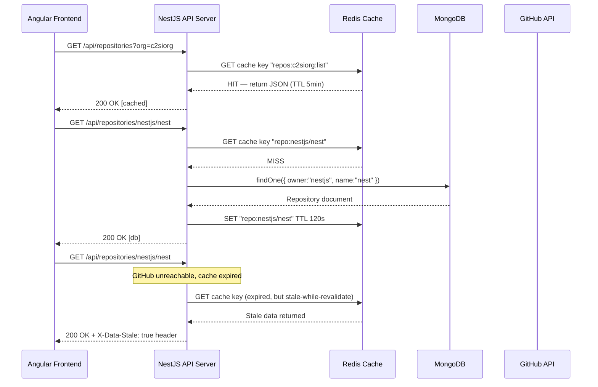
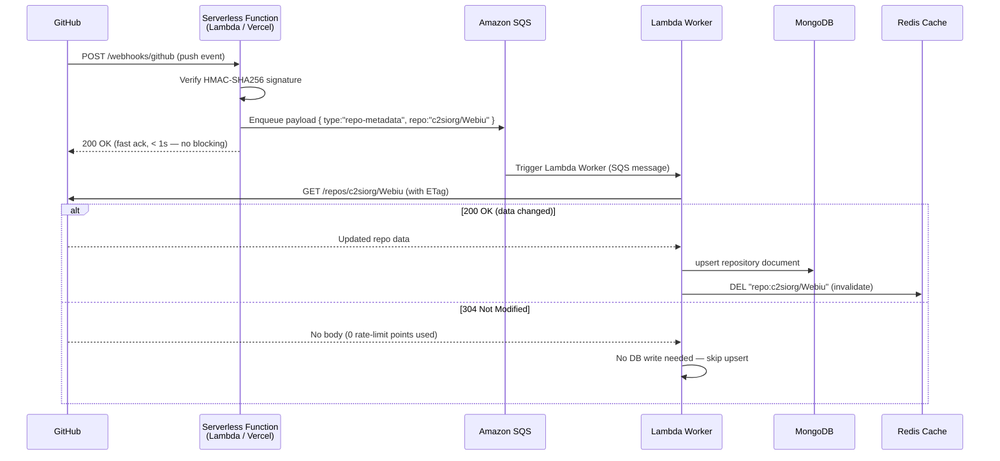
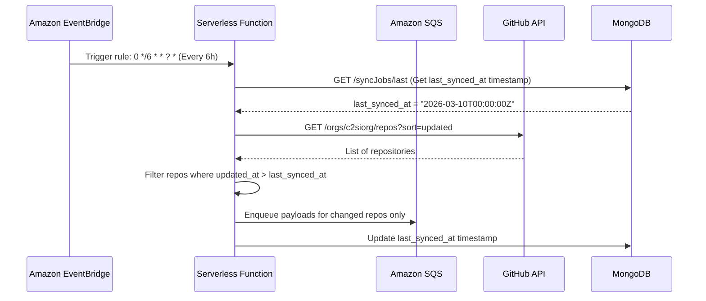

# API Flow — GitHub Data Aggregation System

## Frontend → Backend Request Lifecycle



## Webhook Ingestion Flow



## Cron Reconciliation Flow (EventBridge)



## REST API Endpoints

### `GET /api/repositories`
Returns paginated list of all tracked repositories.

**Query params**: `org`, `page`, `limit`, `sort` (stars|updated|name), `language`, `topic`

**Response**:
```json
{
  "data": [
    {
      "id": "...",
      "owner": "c2siorg",
      "name": "Webiu",
      "description": "...",
      "stars": 120,
      "forks": 45,
      "primaryLanguage": "TypeScript",
      "topics": ["angular", "nestjs", "gsoc"],
      "updatedAt": "2026-03-10T08:00:00Z",
      "syncedAt": "2026-03-12T06:00:00Z"
    }
  ],
  "meta": { "page": 1, "limit": 20, "total": 314 }
}
```

### `GET /api/repositories/:owner/:name`
Returns full details for a single repository.

**Response**:
```json
{
  "owner": "c2siorg",
  "name": "Webiu",
  "stars": 120,
  "forks": 45,
  "openIssues": 12,
  "languages": { "TypeScript": 78.4, "SCSS": 14.2, "HTML": 7.4 },
  "contributors": [
    { "login": "user1", "avatarUrl": "...", "contributions": 234 }
  ],
  "topics": ["angular", "nestjs"],
  "homepage": "https://webiu.c2si.ai",
  "lastCommitAt": "2026-03-10T08:00:00Z"
}
```

### `POST /webhooks/github`
Serverless Function endpoint (AWS Lambda / Vercel). Verifies HMAC-SHA256 signature
and enqueues a typed payload into Amazon SQS. Returns `200 OK` to GitHub in < 1s.
Invalid signatures are rejected with `401` before the payload reaches the queue.

**Headers**: `X-GitHub-Event`, `X-Hub-Signature-256`

### `GET /api/health`
Returns service health and cache/DB status.

## GraphQL Schema (subset)

```graphql
type Repository {
  id: ID!
  owner: String!
  name: String!
  description: String
  stars: Int!
  forks: Int!
  primaryLanguage: String
  languages: JSON
  topics: [String!]
  contributors(limit: Int = 10): [Contributor!]
  openIssues: Int!
  updatedAt: DateTime!
}

type Contributor {
  login: String!
  avatarUrl: String!
  contributions: Int!
  profileUrl: String!
}

type Query {
  repositories(org: String, language: String, topic: String, limit: Int, offset: Int): [Repository!]!
  repository(owner: String!, name: String!): Repository
}

type Subscription {
  repositoryUpdated(owner: String!, name: String!): Repository!
}
```

The Angular frontend subscribes to `repositoryUpdated` to show live updates without polling.
