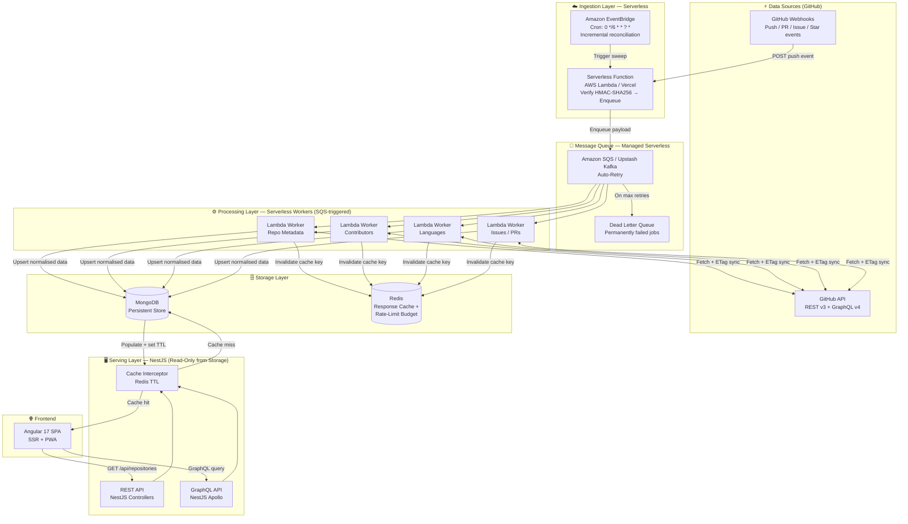
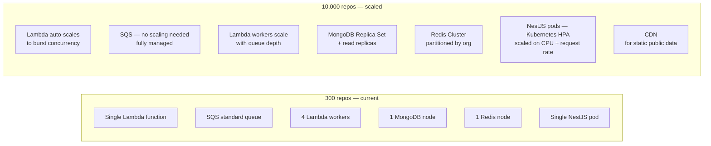

# Architecture Diagram — Scalable GitHub Data Aggregation System

## System Architecture (Mermaid)



> **The hard boundary:** Serverless owns everything from GitHub event → queue → worker → write.
> NestJS owns everything from read → cache → serve → frontend.
> Neither layer crosses into the other's responsibility.

---

## Component Responsibilities

| Component | Layer | Role |
|-----------|-------|------|
| **GitHub Webhooks** | Source | Pushes real-time events (push, PR, issue, star) to the Serverless Function endpoint |
| **GitHub API (REST v3 + GraphQL v4)** | Source | Queried exclusively by Lambda workers — never by the serving layer |
| **Serverless Function (Lambda / Vercel)** | Ingestion | Receives webhook POST, verifies HMAC-SHA256 signature, enqueues payload to SQS. Returns `200 OK` to GitHub in < 1s. Scales to zero when idle. |
| **Amazon EventBridge** | Ingestion | Serverless cron rule (`0 */6 * * ? *`) that fires every 6 hours to trigger the Serverless Function for an incremental sweep — catches any events missed by webhook delivery failures. |
| **Amazon SQS / Upstash Kafka** | Queue | Decouples ingestion from processing. Absorbs burst traffic. Native DLQ and exponential-backoff retry. Visibility timeout prevents duplicate processing. |
| **Lambda Workers (×4)** | Processing | Each SQS message triggers one worker. Fetches only the changed data domain from GitHub (with ETag conditional request). Upserts result into MongoDB. Invalidates the affected Redis cache key. |
| **Dead Letter Queue** | Processing | Receives messages that have exhausted all retries. Triggers an alert; messages are replayed manually or on the next cron cycle. |
| **MongoDB** | Storage | Ground-truth persistent store for all repository data, contributor lists, language breakdowns, and sync audit logs |
| **Redis** | Storage | Dual-purpose: HTTP response cache (TTL per data type) and shared rate-limit budget tracker across all worker invocations |
| **NestJS REST API** | Serving | `GET /api/repositories`, `GET /api/repositories/:owner/:name` — reads from Redis then MongoDB. Never calls GitHub. |
| **NestJS GraphQL API** | Serving | Flexible field-selection queries for the Angular frontend. Reduces over-fetching across 300+ repo cards. |
| **Cache Interceptor** | Serving | Sits in front of all NestJS endpoints. On cache miss: queries MongoDB, populates Redis, returns data. During GitHub outage: serves stale data with `X-Data-Stale: true` header. |
| **Angular 17 SPA** | Frontend | Consumes the NestJS serving layer exclusively. Never calls GitHub directly. SSR on first load; PWA cache for repeat visits. |

---

## The Two Flows Side-by-Side

```
INGESTION FLOW  (serverless, event-driven, scales to zero)
──────────────────────────────────────────────────────────
GitHub Event
    └─► Serverless Function  (verify HMAC, enqueue)
            └─► Amazon SQS   (buffer, retry, DLQ)
                    └─► Lambda Worker  (fetch from GitHub API w/ ETag)
                                └─► MongoDB  (upsert)
                                └─► Redis    (cache invalidate)

SERVING FLOW  (NestJS, always-on, consistent low latency)
──────────────────────────────────────────────────────────
Frontend GET /api/repositories
    └─► NestJS Cache Interceptor
            ├─► Redis HIT  → return immediately  (~5ms)
            └─► Redis MISS → MongoDB query
                                └─► populate Redis (TTL)
                                └─► return to frontend
```

---

## Cache TTL Policy

| Data Type | Redis TTL | Rationale |
|-----------|-----------|-----------|
| Repository list (all repos) | 5 minutes | Balance freshness vs. read load |
| Single repo detail | 2 minutes | Changed more frequently |
| Contributors | 1 hour | Slow-moving data |
| Languages | 6 hours | Very slow-moving data |
| Rate-limit budget tracker | Until reset window | Shared across all worker invocations |

---

## Scaling: 300 → 10,000 Repositories



| Concern | 300 repos | 10,000 repos |
|---------|-----------|--------------|
| Webhook burst handling | Lambda single invocation | Lambda scales to thousands of concurrent invocations automatically |
| Queue throughput | SQS standard queue | SQS FIFO per org — no config change needed |
| Worker throughput | 4 worker functions | Lambda concurrency scales linearly with queue depth |
| GitHub rate limits | PAT token pool | Migrate to GitHub App — 15,000 req/hr per installation |
| Database reads | Single MongoDB node | Replica Set + read replicas; NestJS API reads from secondaries |
| Cache capacity | Single Redis node | Redis Cluster with consistent hashing, partitioned by org |
| API throughput | Single NestJS pod | Kubernetes HPA — scale NestJS pods on CPU/request rate |
| Cold start (new org) | — | Backfill pipeline: GraphQL `nodes` query, 100 repos per request |