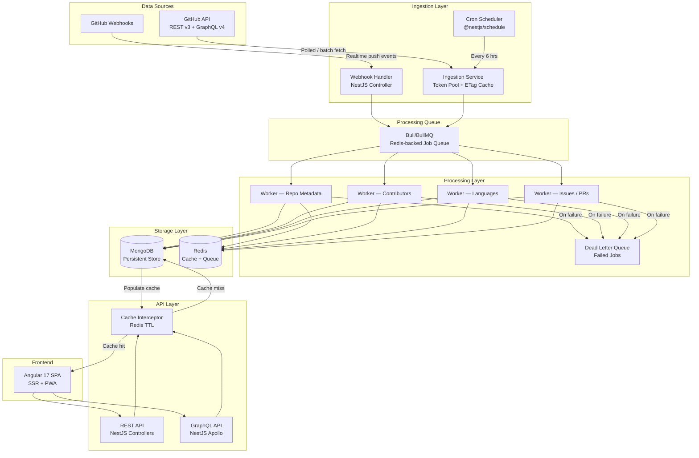
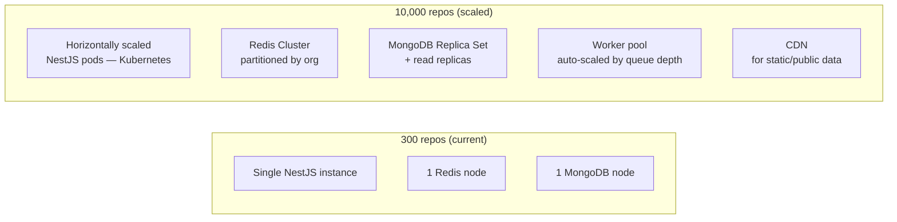

# Architecture Diagram — Scalable GitHub Data Aggregation System

## System Architecture (Mermaid)

## Component Responsibilities

| Component | Role |
|-----------|------|
| **Webhook Handler** | Receives GitHub push/release/star/issue events in real-time; enqueues targeted repo update jobs |
| **Cron Scheduler** | Periodic full-sweep fallback (every 6 h) for repos with no webhook; incremental sync using `since` param |
| **Ingestion Service** | Owns token pool rotation, ETag-based conditional requests, rate-limit budget tracking |
| **Bull Queue** | Decouples ingestion from processing; provides retry, concurrency control, and backpressure |
| **Workers (x4)** | Each worker handles one data domain (metadata / contributors / languages / issues) in parallel |
| **Dead Letter Queue** | Permanently failed jobs are stored, alerted, and retried manually or on next cycle |
| **MongoDB** | Ground-truth persistent store — all repo data, history, analytics |
| **Redis** | Dual-purpose: job queue backend + HTTP response cache with TTL |
| **NestJS API** | REST + GraphQL endpoints consumed by the Angular frontend |
| **Cache Interceptor** | Serves stale data during GitHub outages; TTL tuned per data freshness requirements |

## Scaling from 300 → 10,000 Repos

